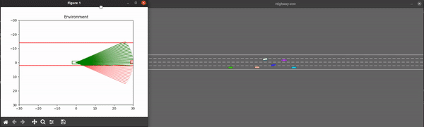

# PhysCov: Physical Test Coverage for Autonomous Vehicles

Adequately exercising the behaviors of autonomous vehicles is fundamental to their validation. However, quantifying an autonomous vehicle's testing adequacy is challenging as the system's behavior is influenced both by its *state* as well as its *physical environment*. To address this challenge, our work builds on two insights. First, data sensed by the autonomous vehicle provides a unique spatial signature of the physical environment inputs.Second, given its current state, inputs residing outside the autonomous vehicle's physically reachable regions are less relevant to its behavior. Building on those insights, we introduce an abstraction that enables the computation of a physical environment-based coverage metric, *PhysCov*. The abstraction combines the sensor readings with a physical reachability analysis based on the vehicle's state and dynamics to determine the region of the environment that may affect the autonomous vehicle. It then characterizes that  region through a parameterizable geometric approximation that can trade quality for cost. Tests with the same characterizations are deemed to have had similar internal states and exposed to similar environments, and thus likely to exercise the same set of behaviors, while tests with distinct characterizations  will increase *PhysCov*. A study on two simulated and one real system examines *PhysCovs*'s ability to quantify an autonomous vehicle's test suite, showcases its characterization cost and precision, and investigates its correlation with failures found and potential for test selection.

We show an example of our approach working on a real world autonomous system below. Here you can see a car driving down a road, the sensor readings, the reduced reachable set, the reachable set vectorization, and finally the RRS values.


## Prerequisites

All notes in this document are related to everything other than BeamNG. To run BeamNG please refer to the [BeamNG Environment README](./environments/beamng/README.md).

### Hardware

This software was developed and run on the following machine:

__Computer 1:__
* Operating System: Ubuntu 20.04
* CPU: AMD Ryzen Threadripper 3990X
* CPU Cores: 128
* RAM: 128 GB

However the entire artifact has also been tested on a machine with lower specifications:

__Computer 2:__
* Operating System: Ubuntu 20.04
* CPU: Intel Core i7-10750H
* CPU Cores: 12
* RAM: 16 GB

### Software

We require several python packages to run our software. To install them you can use the package manager `pip`. 

```bash
sudo apt install python3-pip
```

Next install the following packages:
```bash
python3 -m pip install --upgrade pip
python3 -m pip install gym==0.18
python3 -m pip install matplotlib
python3 -m pip install coverage==5.5
python3 -m pip install shapely
python3 -m pip install /environments/highway/highway_env_v2
python3 -m pip install numpy==1.19.5
python3 -m pip install pandas==1.2.0
python3 -m pip install ordered_set
```

## Getting Started

| Component         	| Description                                                                                               	| Link 	|
|-------------------	|-----------------------------------------------------------------------------------------------------------	|------	|
| Highway-Env       	| This will describe how to run the HighwayEnv environment, and how to generate sample runs.                	| [README.MD](./environments/highway/README.md)    	|
| BeamNG            	| This will describe how to run the BeamNG environment, and how to generate sample runs. (Requires windows) 	| [README.MD](./environments/beamng/README.md)    	|
| Waymo             	| This will describe how to run the Waymo Open Perception Dataset, and how to extract the data.             	| [README.MD](./environments/waymo/README.md)    	|
| RRS Visualization 	| This will show you how to create visualizations of the RRS data.                                          	| [README.MD](./visulization/README.md)    	        |
| RRS Pipeline      	| This will show you how to run the RRS Pipeline on example data, as well as your own.                      	| [README.MD](./processing_pipeline/README.md)      |
| Data Analysis     	| This will show you how to generate the graphs presented in our paper.                                     	| [README.MD](./data_analysis/README.md)    	    |
| Provided Data      	| This will provide a subset of the data from the original data. The original data is over 2TB.                	| [README.MD](./data_subset/README.md)              |

# Examples

Here are some examples of what this repo will guide you through

## Generating data using HighwayEnv



##  Generating data using BeamNG

Will be completed by Sunday Feb 19th

## Extracting data from the Waymo Perception Open Dataset

Will be completed by Sunday Feb 19th