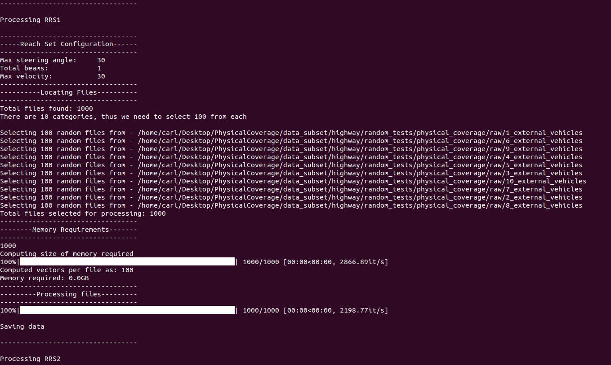

# PhysCov: Physical Test Coverage for Autonomous Vehicles

Adequately exercising the behaviors of autonomous vehicles is fundamental to their validation. However, quantifying an autonomous vehicle's testing adequacy is challenging as the system's behavior is influenced both by its *state* as well as its *physical environment*. To address this challenge, our work builds on two insights. First, data sensed by the autonomous vehicle provides a unique spatial signature of the physical environment inputs.Second, given its current state, inputs residing outside the autonomous vehicle's physically reachable regions are less relevant to its behavior. Building on those insights, we introduce an abstraction that enables the computation of a physical environment-based coverage metric, *PhysCov*. The abstraction combines the sensor readings with a physical reachability analysis based on the vehicle's state and dynamics to determine the region of the environment that may affect the autonomous vehicle. It then characterizes that  region through a parameterizable geometric approximation that can trade quality for cost. Tests with the same characterizations are deemed to have had similar internal states and exposed to similar environments, and thus likely to exercise the same set of behaviors, while tests with distinct characterizations  will increase *PhysCov*. A study on two simulated and one real system examines *PhysCovs*'s ability to quantify an autonomous vehicle's test suite, showcases its characterization cost and precision, and investigates its correlation with failures found and potential for test selection.

# Prerequisites

All notes in this document are related to everything other than BeamNG. To run BeamNG please refer to the [BeamNG Environment README](./environments/beamng/README.md).

## Hardware

This software was developed and run on the following machine:

__Computer 1:__
* Operating System: Ubuntu 20.04
* CPU: AMD Ryzen Threadripper 3990X
* CPU Cores: 128
* RAM: 128 GB

However the entire artifact has also been tested on a machine with lower specifications:

__Computer 2:__
* Operating System: Ubuntu 20.04
* CPU: Intel Core i7-10750H
* CPU Cores: 12
* RAM: 16 GB

## Software

We require several python packages to run our software. To install them you can use the package manager `pip`. 

```bash
sudo apt install python3-pip
```

Next install the following packages:
```bash
python3 -m pip install --upgrade pip
python3 -m pip install gym==0.18
python3 -m pip install matplotlib
python3 -m pip install coverage==5.5
python3 -m pip install shapely
python3 -m pip install /environments/highway/highway_env_v2
python3 -m pip install numpy==1.19.5
python3 -m pip install pandas==1.2.0
python3 -m pip install ordered_set
```

# Environments

### Running an example

Our study was run on three different environments. We give details on how to run each of the environments below:

## Highway-Env

Before we run the study, we can run a test scenario to showcase the highway environment in action.

```
cd environments/highway
python3 run_random_scenario.py --environment_vehicles 5 --save_name test
```

You should get the following output on your screen:


This should also create an `output` folder. The output folder will contain the physical coverage in a standardized format `raw`, as well as the code coverage in a `raw` format.

### Creating study data

In our study we generated 1,000,000 tests. To do that we can use the scripts provided in the in `environments/highway/scripts` folder. The script you want to run is `run_random_scenario.sh`. This script will generate 100 tests:
* 10 tests with 1 traffic vehicle
* 10 tests with 2 traffic vehicle
* ...
* 10 tests with 10 traffic vehicle


__Note:__ make sure you delete the output folder generated in `Running an example`, otherwise you will end up with 101 tests (100 from the script and 1 from your test run).

To run the script you can use:

```bash
cd environments/highway
./scripts/run_random_scenarios.sh
```

This will execute significantly faster than the example, as the GUI is turned off, and running faster than time is enabled. It took __computer 2__ 5 minutes to complete.

__Note:__ Multiple of these scripts can be run in parallel. Simply open multiple terminals and run them. For the study we ran 50 scripts in parallel on __computer 1__.

## BeamNG

Please refer to the [BeamNG Environment README](./environments/beamng/README.md).

## Waymo

TODo

# Provided Data

Todo

# Running PhysCov Pipeline

The raw format actually contains a version of the PhysCov vectors. For example if you look at `data_subset/highway/random_tests/physical_coverage/raw/1_external_vehicles/1-1639594889-21ox.txt` you will see the following:

```
Name: 1-1639594889-21ox
Date: 15/12/2021
Time: 14:1:30
External Vehicles: 1
Reach set total lines: 31
Reach set steering angle: 30
Reach set max distance: 30
------------------------------
Vector: [11.998, 12.778, 13.685, 14.749, 16.014, 17.54, 19.413, 21.764, 24.797, 28.854, 30.0, 30.0, 30.0, 30.0, 30.0, 30.0, 30.0, 30.0, 30.0, 30.0, 30.0, 30.0, 30.0, 30.0, 30.0, 29.235, 26.692, 24.583, 22.809, 21.298, 19.998]
Ego Position: [312.7561   4.    ]
Ego Velocity: [24.2558  0.    ]
Crash: False
Collided: False
Operation Time: 0.012143
Total Wall Time: 0.030084
Total Simulated Time: 0.25

Vector: [11.998, 12.778, 13.685, 14.749, 16.014, 17.54, 19.413, 21.764, 24.797, 28.854, 30.0, 30.0, 30.0, 30.0, 30.0, 30.0, 30.0, 30.0, 30.0, 30.0, 30.0, 30.0, 30.0, 30.0, 30.0, 29.235, 26.692, 24.583, 22.809, 21.298, 19.998]
Ego Position: [317.7302   4.    ]
Ego Velocity: [25.9657  0.    ]
Crash: False
Collided: False
Operation Time: 0.011229
Total Wall Time: 0.059326
Total Simulated Time: 0.5

...
```

Here you can see the date and time the test was run. What parameters were used for the initial computation. Our pipeline works by creating a vector 30 wide, which we then need to convert into the appropriate RRS vectors.

To do that we use the `preprocessing` folder.

## Highway

### Physical Coverage

To generate the physical coverage on `highway-env` you need to run the `preprocess_highway_random_physcov_coverage` script. The script has the following parameters
* Number of tests: In our datasubset we give you 1000
* Distribution: In our study we use center_close
* Path to data: The __FULL__ path to the data folder

An example of running the script is below:
```bash
cd preprocessing/
./scripts/preprocess_highway_random_physcov_coverage.sh 1000 center_close <full path to folder>/PhysicalCoverage/data_subset
```

If everything is run correctly you should have the following output on your terminal


Once this is done running you will have an `output` folder. This script will have generated several `npy` files in the folder `output/highway/random_tests/physical_coverage/processed/center_close/1000/`. You will have the following numpy files:

* `crash_hash_highway_random_s{X}_b{Y}_d{Z}_t{W}.npy`: Contains up to 10 hashes for each test, where each hash describes a crash based on the velocity and angle of incident.
* `ego_positions_highway_random_s{X}_b{Y}_d{Z}_t{W}.npy`: Contains the ego position in the world frame for each test.
* `processed_files_highway_random_s{X}_b{Y}_d{Z}_t{W}.npy`: Contains the original file name used to create each row in the numpy arrays.
* `stall_hash_highway_random_s{X}_b{Y}_d{Z}_t{W}.npy`: Contains up to 10 hashes for each test, where each hash describes a stall based on the angle and distance to the closest vehicle.
* `time_highway_random_s{X}_b{Y}_d{Z}_t{W}.npy`: Contains the total time of each test.
* `traces_hash_highway_random_s{X}_b{Y}_d{Z}_t{W}.npy`: Contains the RRS vectors for each step of each test.
* `vehicles_hash_highway_random_s{X}_b{Y}_d{Z}_t{W}.npy`: Contains the total number of traffic vehicles in each test.

Where `X` is the steering angle. `Y` is the RRS number. `Z` is the maximum distance the vehicle can travel in 1 time step. `W` is the number of tests used.

__Note__: This data in output will match what was given to you in the `data_subset`.

### Code Coverage

To generate the code coverage on `highway-env` you need to run the `preprocess_highway_random_code_coverage` script. The script has the following parameters
* Number of tests: In our datasubset we give you 1000
* Path to data: The __FULL__ path to the data folder
An example of running the script is below:
```bash
cd preprocessing/
./scripts/preprocess_highway_random_code_coverage.sh 1000 <full path to folder>/PhysicalCoverage/data_subset
```

If everything is run correctly you should have the following output on your terminal


Once this is done running you will have an `output` folder. This script will have generated several `txt` files in the folder `output/highway/random_tests/code_coverage/processed/1000`. Each file generated is for a single test. Each file contains:

* `File name`: The file(s) which was monitored using code coverage
* `Lines covered`: The lines which were covered
* `All lines`: All lines in the file
* `Branches covered`: The branches which were taken
* `All branches`: All branches 
* `Intraprocedural prime path signature`: The hash of the intraprocedural prime path
* `Intraprocedural path signature`: The hash of the intraprocedural path
* `Absolute path signature`: The hash of the absolute path

__Note__: This data in output will match what was given to you in the `data_subset`.

## BeamNG

## Waymo