# Coverage Analysis

Below we provide how the data was analyzed in each research question on both the data subset provided by this artifact, as well as on the original data. We have also provided supplementary analysis.

# Research Questions

## RQ1


### Data Subset

```bash
python3 RQ1_correlation_codecov.py --number_of_test_suites 100 --number_of_tests 1000 --distribution center_close --scenario highway --cores 120 --data_path /home/carl/Desktop/PhysicalCoverage/data_subset
```

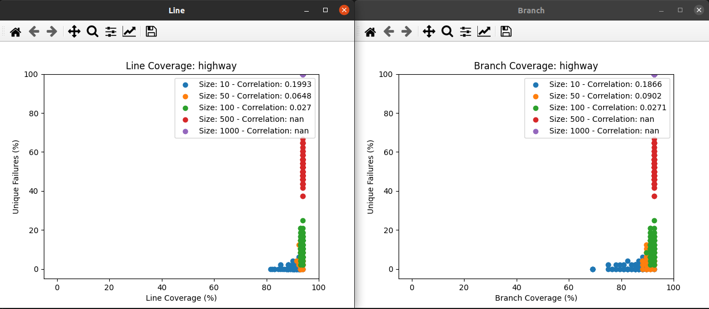


```bash
python3 RQ1_correlation_codecov.py --number_of_test_suites 100 --number_of_tests 1000 --distribution center_close --scenario beamng --cores 120 --data_path /home/carl/Desktop/PhysicalCoverage/data_subset
```


```bash
python3 RQ1_correlation_physcov.py --number_of_test_suites 100 --number_of_tests 1000 --distribution center_close --scenario highway --cores 120 --RRS 10 --data_path /home/carl/Desktop/PhysicalCoverage/data_subset
```


```bash
python3 RQ1_correlation_physcov.py --number_of_test_suites 100 --number_of_tests 1000 --distribution center_close --scenario beamng --cores 120 --RRS 10 --data_path /home/carl/Desktop/PhysicalCoverage/data_subset
```


TODO TRAJECTORY COVERAGE

```bash
python3 RQ1_coverage_vs_failures.py --scenario highway --number_of_tests 1000 --distribution center_close --cores 120 --data_path /home/carl/Desktop/PhysicalCoverage/data_subset
```


```bash
python3 RQ1_coverage_vs_failures.py --scenario beamng --number_of_tests 1000 --distribution center_close --cores 120 --data_path /home/carl/Desktop/PhysicalCoverage/data_subset
```


```bash
python3 RQ1_signature_test.py --scenario highway --number_of_tests 1000 --distribution center_close --cores 120 --data_path /home/carl/Desktop/PhysicalCoverage/data_subset
```


```bash
python3 RQ1_signature_test.py --scenario beamng --number_of_tests 1000 --distribution center_close --cores 120 --data_path /home/carl/Desktop/PhysicalCoverage/data_subset
```


### Full Dataset

```bash
python3 RQ1_correlation_codecov.py --number_of_test_suites 100 --number_of_tests 1000000 --distribution center_close --scenario highway --cores 120 --data_path /home/carl/Desktop/PhysicalCoverage/data_subset
```

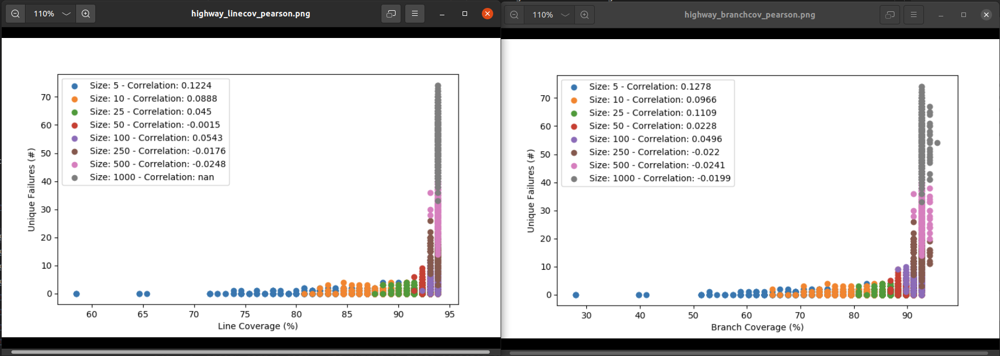


```bash
python3 RQ1_correlation_codecov.py --number_of_test_suites 100 --number_of_tests 10000 --distribution center_close --scenario beamng --cores 120 --data_path /home/carl/Desktop/PhysicalCoverage/data_subset
```

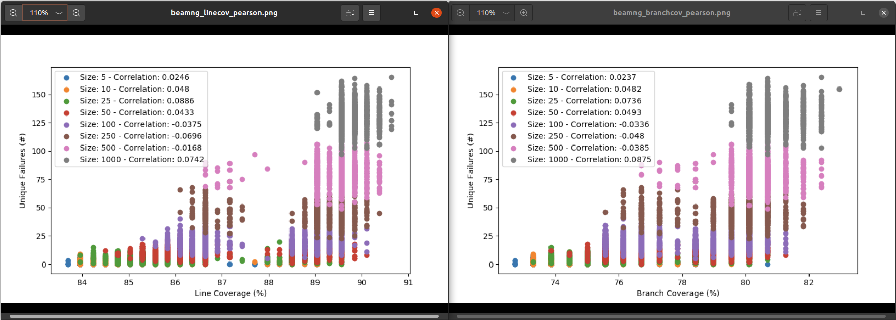

```bash
python3 RQ1_correlation_physcov.py --number_of_test_suites 100 --number_of_tests 1000000 --distribution center_close --scenario highway --cores 120 --RRS 10 --data_path /home/carl/Desktop/PhysicalCoverage/data_subset
```

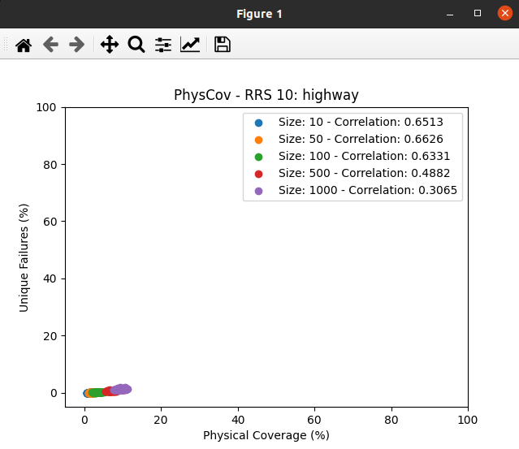

```bash
python3 RQ1_correlation_physcov.py --number_of_test_suites 100 --number_of_tests 10000 --distribution center_close --scenario beamng --cores 120 --RRS 10 --data_path /home/carl/Desktop/PhysicalCoverage/data_subset
```

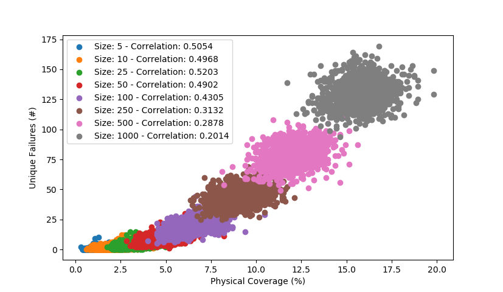


TODO TRAJECTORY COVERAGE

```bash
python3 RQ1_coverage_vs_failures.py --scenario highway --number_of_tests 1000000 --distribution center_close --cores 120 --data_path /home/carl/Desktop/PhysicalCoverage/data_subset
```

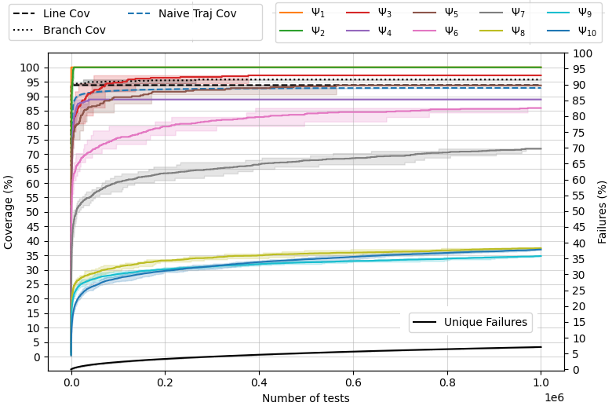

```bash
python3 RQ1_coverage_vs_failures.py --scenario beamng --number_of_tests 10000 --distribution center_close --cores 120 --data_path /home/carl/Desktop/PhysicalCoverage/data_subset
```

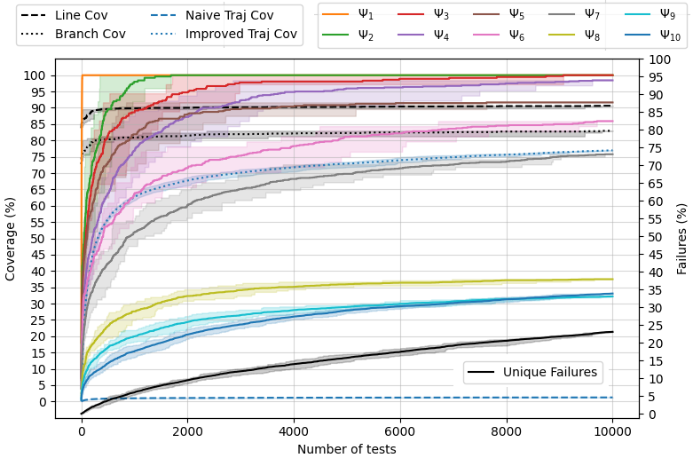


```bash
python3 RQ1_signature_test.py --scenario highway --number_of_tests 1000000 --distribution center_close --cores 120 --data_path /home/carl/Desktop/PhysicalCoverage/data_subset
```

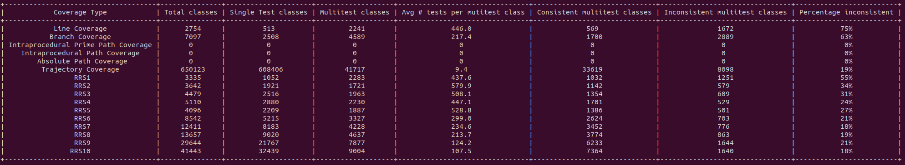

```bash
python3 RQ1_signature_test.py --scenario beamng --number_of_tests 10000 --distribution center_close --cores 120 --data_path /home/carl/Desktop/PhysicalCoverage/data_subset
```

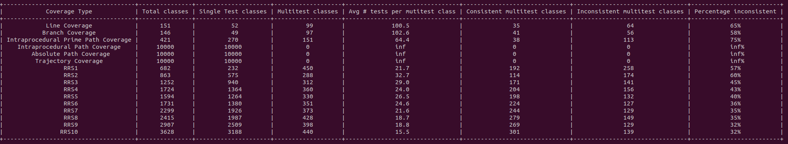

## RQ2

### Data Subset

```bash
python3 RQ2_test_selection.py --number_of_tests 1000 --distribution center_close --RRS_number 10 --scenario highway --cores 120 --greedy_sample_size 100 --data_path /home/carl/Desktop/PhysicalCoverage/data_subset
```


```bash
python3 RQ2_test_selection.py --number_of_tests 1000 --distribution center_close --RRS_number 10 --scenario beamng --cores 120 --greedy_sample_size 100 --data_path /home/carl/Desktop/PhysicalCoverage/data_subset
```


### Full Dataset


```bash
python3 RQ2_test_selection.py --number_of_tests 1000000 --distribution center_close --RRS_number 10 --scenario highway --cores 120 --greedy_sample_size 100 --data_path /home/carl/Desktop/PhysicalCoverage/data_subset
```

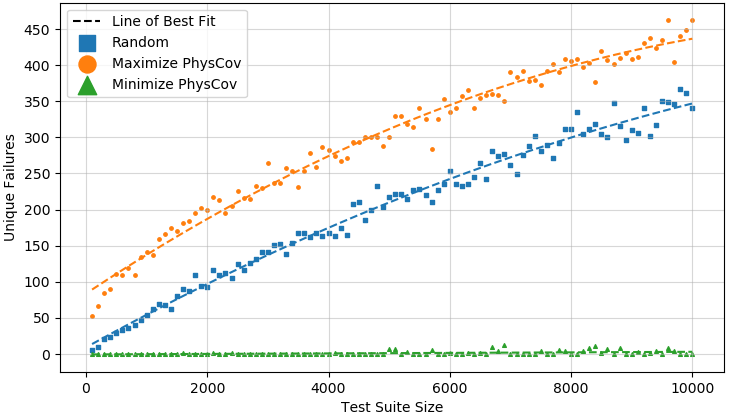

```bash
python3 RQ2_test_selection.py --number_of_tests 10000 --distribution center_close --RRS_number 10 --scenario beamng --cores 120 --greedy_sample_size 100 --data_path /home/carl/Desktop/PhysicalCoverage/data_subset
```

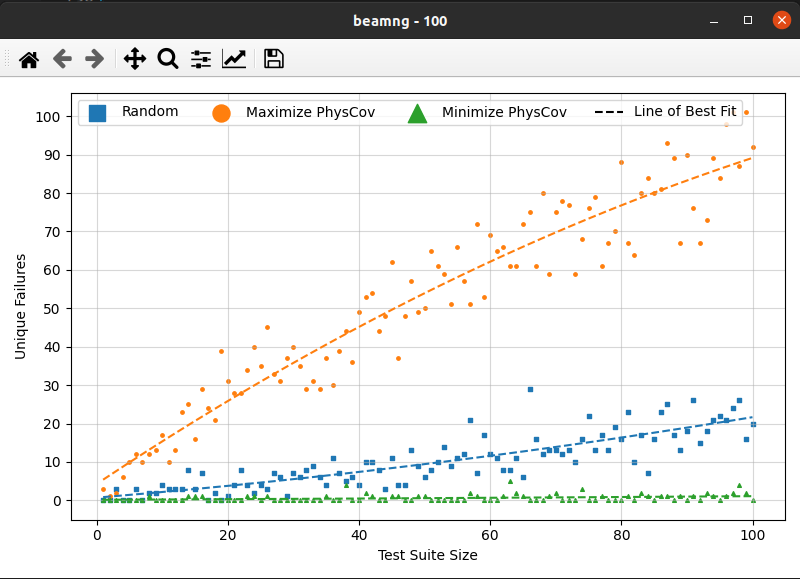

## RQ3

Waymo provides the entire dataset.

### Full Dataset

```bash
python3 RQ3_compute_total_coverage.py --distribution center_full --data_path /home/carl/Desktop/PhysicalCoverage/data_subset
```


```bash
python3 RQ3_identify_similar_scenarios.py --scenario waymo --number_of_tests 798 --distribution center_full --cores 120 --tracking 3 --data_path /home/carl/Desktop/PhysicalCoverage/data_subset
```

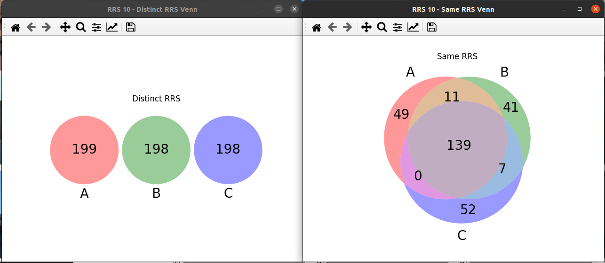


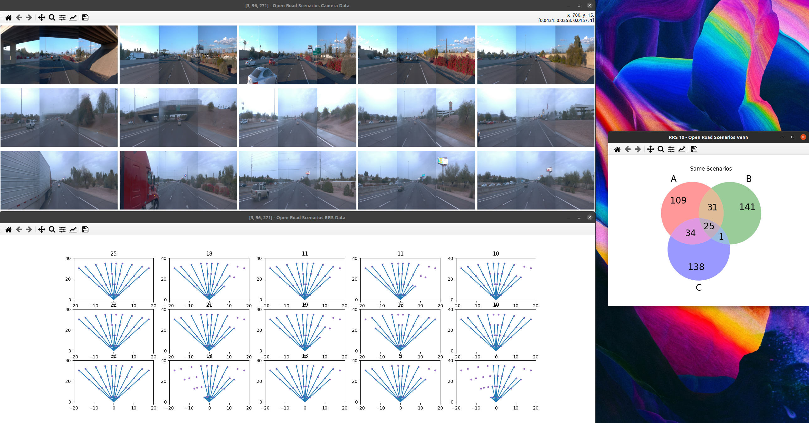


# Other Analysis