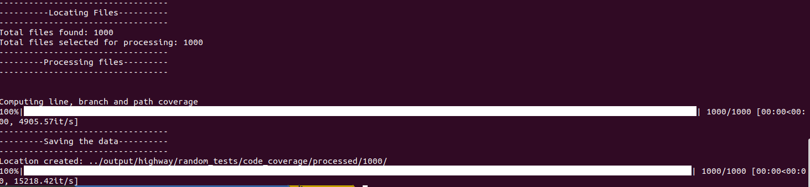
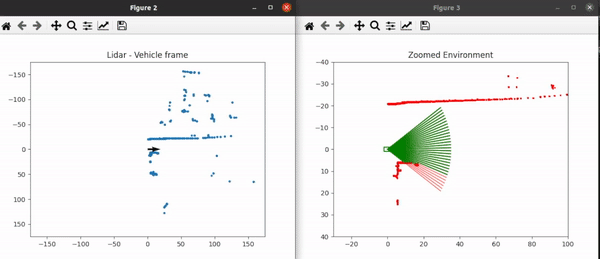
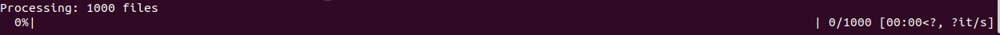
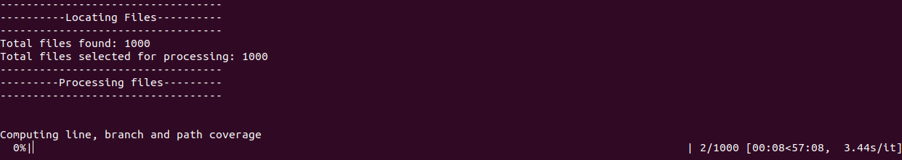
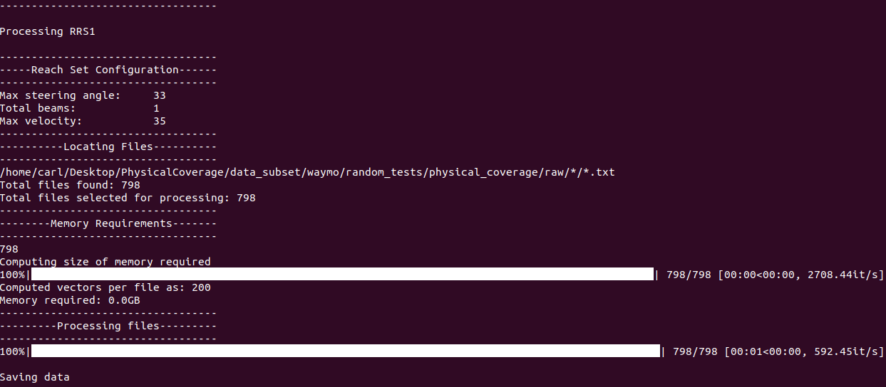

# Processing Pipeline

This is used to take the data from our standard format and converts it into a series of numpy arrays. For a deeper understanding on what is contained in our standard data format read the data subset [README.MD](./data_subset/README.md). This pipeline will create the following numpy arrays

* `crash_hash_highway_random_s{X}_b{Y}_d{Z}_t{W}.npy`: Contains up to 10 hashes for each test, where each hash describes a crash based on the velocity and angle of incident.
* `ego_positions_highway_random_s{X}_b{Y}_d{Z}_t{W}.npy`: Contains the ego position in the world frame for each test.
* `processed_files_highway_random_s{X}_b{Y}_d{Z}_t{W}.npy`: Contains the original file name used to create each row in the numpy arrays.
* `stall_hash_highway_random_s{X}_b{Y}_d{Z}_t{W}.npy`: Contains up to 10 hashes for each test, where each hash describes a stall based on the angle and distance to the closest vehicle.
* `time_highway_random_s{X}_b{Y}_d{Z}_t{W}.npy`: Contains the total time of each test.
* `traces_hash_highway_random_s{X}_b{Y}_d{Z}_t{W}.npy`: Contains the RRS vectors for each step of each test.
* `vehicles_hash_highway_random_s{X}_b{Y}_d{Z}_t{W}.npy`: Contains the total number of traffic vehicles in each test.

Where `X` is the steering angle. `Y` is the RRS number. `Z` is the maximum distance the vehicle can travel in 1 time second. `W` is the number of tests used.


Below we take a look at how to run the RRS pipeline on each of the data subsets provided.

---

## HighwayEnv

### Sensors to Standard Format

We designed HighwayEnv to save data in the standard format, this no pre-processing is required to convert it into the standard format.

### Physical Coverage

To generate the physical coverage on `highway-env` you need to run the `process_highway_physcov_coverage` script. The script has the following parameters
* Number of tests: In our data_subset we give you 1000
* Distribution: In our study we use `center_close`
* Path to data: The __FULL__ path to the data folder

An example of running the script is below:
```bash
cd processing_pipeline/
./scripts/process_highway_physcov_coverage.sh 1000 center_close <full path to folder>/PhysicalCoverage/data_subset
```

If everything is run correctly you should have the following output on your terminal


Once this is done running you will have an `output` folder. This script will have generated several `npy` files in the folder `output/highway/random_tests/physical_coverage/processed/center_close/1000/`. described above.

__Note__: The data in output will match what was given to you in the `data_subset`.

To view the 671st test from RRS-5 values from the first test you can run the following in your terminal:

```bash
cd ./data_subset/highway/random_tests/physical_coverage/processed/center_close/1000
python3
>>> import numpy as np
>>> rrs = np.load("traces_highway_random_s30_b5_d30_t1000.npy")
>>> print(np.shape(rrs))
(1000, 100, 5)
>>> print(rrs[670])
array([[10., 10., 10., 10., 10.],
       [10., 10., 10., 10., 10.],
       ...
       [10.,  5.,  5., 10., 10.],
       [10., 10.,  5.,  5.,  5.],
       [10., 10., 10., 10.,  5.],
       [10., 10., 10., 10.,  5.],
       [10., 10., 10., 10.,  5.],
       [ 5., 10., 10., 10.,  5.],
       [ 5., 10., 10.,  5.,  5.],
       [ 5., 10., 10.,  5.,  5.],
       [ 5., 10., 10.,  5.,  5.],
       [ 5., 10., 10.,  5.,  5.],
       [ 5., 10.,  5.,  5.,  5.],
       [10., 10., 10., 10., 10.],
       ...
       [10., 10., 10., 10., 10.]])
>>> exit()
```

Here we can see that the shape is `(1000, 100, 5)`. This is because there are `1000` tests, each with `100` rrs vectors with each vector being length `5`.

### Code Coverage

To generate the code coverage on `highway-env` you need to run the `process_highway_code_coverage` script. The script has the following parameters
* Number of tests: In our data_subset we give you 1000
* Path to data: The __FULL__ path to the data folder


An example of running the script is below:
```bash
cd processing_pipeline/
./scripts/process_highway_code_coverage.sh 1000 <full path to folder>/PhysicalCoverage/data_subset
```

If everything is run correctly you should have the following output on your terminal


Once this is done running you will have an `output` folder. This script will have generated several `txt` files in the folder `output/highway/random_tests/code_coverage/processed/1000`. Each file generated is for a single test. Each file contains:

* `File name`: The file(s) which was monitored using code coverage
* `Lines covered`: The lines which were covered
* `All lines`: All lines in the file
* `Branches covered`: The branches which were taken
* `All branches`: All branches 
* `Intraprocedural prime path signature`: The hash of the intraprocedural prime path
* `Intraprocedural path signature`: The hash of the intraprocedural path
* `Absolute path signature`: The hash of the absolute path

__Note__: This data in output will match what was given to you in the `data_subset`.

---

## BeamNG

### Lidar to Standard Format

BeamNG returns its sensor readings as LiDAR data which we first need to convert to our standard format. To do that we use the scripts in `beamng_to_standard_format`.

First we can visualize what this script does using

```bash
cd processing_pipeline/beamng_to_standard_format
python3 lidar_to_RRS.py --data_path /home/carl/Desktop/PhysicalCoverage/data_subset --cores 1 --plot
```

You should see the following two plots appear. The left hand side shows the LiDAR rotated into the vehicles frame. The second shows the sensed reachable set. **Note:** This visualization has been sped up, it can take some time to process and plot the large number of points.



We can now convert this into our own processing by not plotting, and using multiple instances. To do that run the following:

```bash
cd processing_pipeline/beamng_to_standard_format
python3 lidar_to_RRS.py --data_path /home/carl/Desktop/PhysicalCoverage/data_subset --cores 16
```

If everything goes correctly you should see the following output:



Once this is done (it can take some time) you will have 1000 files in our standard format in the `output/beamng/random_tests/physical_coverage/raw` folder. These files will match the ones provided to you in the `data_subset` folder. 

### Physical Coverage

To generate the physical coverage on `beamng` you need to run the `process_beamng_physcov_coverage` script. The script has the following parameters
* Number of tests: In our data_subset we give you 1000
* Distribution: In our study we use `center_close`
* Path to data: The __FULL__ path to the data folder

An example of running the script is below:
```bash
cd processing_pipeline/
./scripts/process_beamng_physcov_coverage.sh 1000 center_close <full path to folder>/PhysicalCoverage/data_subset
```

If everything is run correctly you should have the following output on your terminal


Once this is done running you will have an `output` folder. This script will have generated several `npy` files in the folder `output/beamng/random_tests/physical_coverage/processed/center_close/1000/`. described above.

__Note__: The data in output will match what was given to you in the `data_subset`.

To view the 671st test from RRS-5 values from the first test you can run the following in your terminal:

```bash
cd ./data_subset/beamng/random_tests/physical_coverage/processed/center_close/1000
python3
>>> import numpy as np
>>> rrs = np.load("traces_beamng_random_s33_b5_d35_t1000.npy")
>>> print(np.shape(rrs))
(1000, 202, 5)
>>> print(rrs[670])
[[10. 10. 10. 10. 10.]
 [10. 10. 10. 10. 10.]
 [10. 10. 10. 10. 10.]
 ...
 [10. 10. 10. 10. 10.]
 [10. 10. 10. 10. 10.]
 [10. 10. 10. 10. 10.]]
>>> exit()
```

Here we can see that the shape is `(1000, 202, 5)`. This is because there are `1000` tests, each with `202` rrs vectors with each vector being length `5`.

### Code Coverage

To generate the code coverage on `beamgn` you need to run the `process_beamng_code_coverage` script. The script has the following parameters
* Number of tests: In our data_subset we give you 1000
* Path to data: The __FULL__ path to the data folder

An example of running the script is below:
```bash
cd processing_pipeline/
./scripts/process_beamng_code_coverage.sh 1000 <full path to folder>/PhysicalCoverage/data_subset
```

If everything is run correctly you should have the following output on your terminal


Once this is done running you will have an `output` folder. This script will have generated several `txt` files in the folder `output/beamng/random_tests/code_coverage/processed/1000`. Each file generated is for a single test. Each file contains:

* `File name`: The file(s) which was monitored using code coverage
* `Lines covered`: The lines which were covered
* `All lines`: All lines in the file
* `Branches covered`: The branches which were taken
* `All branches`: All branches 
* `Intraprocedural prime path signature`: The hash of the intraprocedural prime path
* `Intraprocedural path signature`: The hash of the intraprocedural path
* `Absolute path signature`: The hash of the absolute path

__Note__: This data in output will match what was given to you in the `data_subset`.

---

## Waymo

### Sensors to Standard Format

To convert the Sensor data to the standard format please read the Waymo [README](../environments/waymo/README.md) file for more information. However your final output should be viewable and would look something like this:


### Physical Coverage

To generate the physical coverage on `waymo` you need to run the `process_waymo_physcov_coverage` script. The script has the following parameters
* Number of tests: In our data_subset we give you 798
* Distribution: In our study we use `center_full`
* Path to data: The __FULL__ path to the data folder

An example of running the script is below:
```bash
cd processing_pipeline/
./scripts/process_beamng_physcov_coverage.sh 798 center_full <full path to folder>/PhysicalCoverage/data_subset
```

If everything is run correctly you should have the following output on your terminal


Once this is done running you will have an `output` folder. This script will have generated several `npy` files in the folder `output/waymo/random_tests/physical_coverage/processed/center_full/798/`. described above.

__Note__: The data in output will match what was given to you in the `data_subset`.

To view the 671st test from RRS-5 values from the first test you can run the following in your terminal:

```bash
cd ./data_subset/waymo/random_tests/physical_coverage/processed/center_full/798
python3
>>> import numpy as np
>>> rrs = np.load("traces_waymo_random_s33_b5_d35_t798.npy")
>>> print(np.shape(rrs))
(798, 200, 5)
>>> print(rrs[670])
[[15. 25. 35. 35. 35.]
 [15. 25. 35. 35. 35.]
 ...
 [15. 35. 20. 35. 35.]
 [15. 35. 20. 35. 35.]
 [nan nan nan nan nan]
 [nan nan nan nan nan]]
>>> exit()
```

Here we can see that the shape is `(798, 200, 5)`. This is because there are `798` tests, each with `200` rrs vectors with each vector being length `5`. You will also notice the last 2 RRS are `nan`. This is expected. Each of the Waymo scenarios were not exactly the same length. To account for this `nan`'s are appended to keep each test the same size.